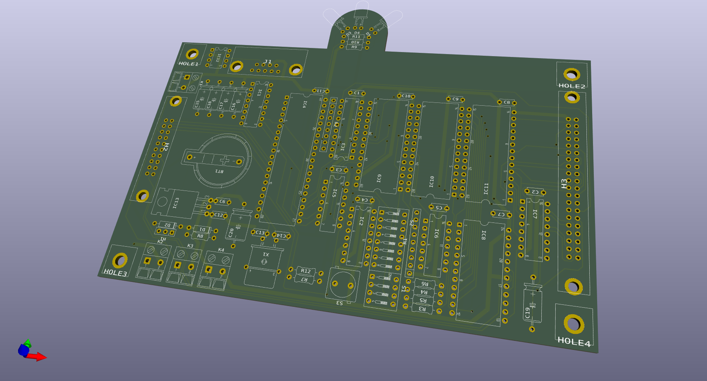
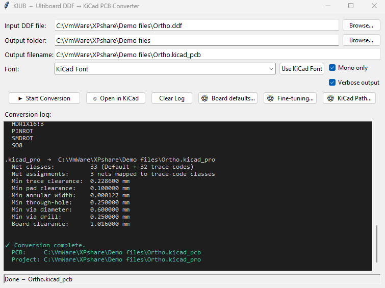

# Ultiboard DDF to KiCad Converter (KIUB)
**Python:** 3.13+ | **License:** GPLv3 | **Target:** KiCad v6, v7, v8, v9+
><ins>**Legal Notice**</ins>\
[KIUB](https://github.com/Snieffy/ultiboard-ddf-to-kicad-converter) is a functional acronym for <ins>**Ki**</ins>Cad <ins>**U**</ins>lti<ins>**B**</ins>oard Converter.\
This is an independent, open-source project and is not affiliated with, sponsored by, or endorsed by any companies sharing a similar name.\
[Ultiboard](https://www.ni.com/nl-be/shop/product/ultiboard.html) is a registered trademark of National Instruments (formerly Ultimate Technology / Electronics Workbench).\
[KiCad](https://www.kicad.org/) is a free software suite for electronic design automation.\
This tool is provided "as-is" for file migration purposes only.

This is a high-fidelity converter designed to migrate legacy **Ultiboard DDF** (`.ddf`) files into modern **KiCad PCB** (`.kicad_pcb`) projects. 

---

## License & Originality

This project is licensed under the **GNU General Public License v3.0 (GPLv3)**.

### Development History
KIUB represents a fundamental evolution and complete refactoring of earlier community-driven conversion concepts. 
While the electronics industry has moved forward, many valuable legacy designs remain locked in Ultiboard's proprietary formats.
KIUB provides a bridge, allowing engineers to revive and maintain these designs within the powerful, open-source KiCad ecosystem.

*   **Primary Research:**\
The core parsing logic and technical specifications are derived from the\
**Ultiboard 32bit DOS and Windows95 - Reference Manual - Appendix A - File Formats (1997-08-15)**.
*   **Modern Implementation:**\
KIUB is a **clean-room-inspired rewrite** in Python 3.13. It abandons procedural limitations in favor of a modern, object-oriented architecture.
*   **Independent Logic:**\
Mathematical errors found in abandoned legacy scripts (e.g., arc midpoint calculations and layer mapping) have been corrected to ensure compatibility with **KiCad v6 through v9+**.

---

## Key Features

*   **Modern KiCad Support:** Generates native S-expression based `.kicad_pcb` files and Json based `.kicad_pro` files.
*   **DDF Support:** Handles both V4.x (database units) and V5.x (nanometer) files.
*   **Advanced Geometry:** Precision handling of tracks, vias, pads (SMD & THT), and complex copper zones.
*   **Unicode Text Support:** Accurately converts Ultiboard internal fonts to KiCad-compatible text strings.
*   **Zero Dependencies:** A lightweight implementation using standard Python libraries.
*   **Layer Intelligence:** Automatic mapping of Ultiboard stackups to KiCad's signal and technical layers.
*   **Optional GUI:** Easy file, folder and font selection (Tkinter package needed).



---

## Usage

KIUB.py [-h] [-v] [-f "font"] "source" [-o "destination"]

| Option | Description |
| :---: | --- |
| `-h` | Only display the help message and exit. |
| `-v` | Print brief progress information. |
| `-f "font"` | Replaces the default Kicad font with a user specified font during conversion.<br> Optimal results are obtained when using the DejaVu Sans Mono font (see info below).|
| `"source"` | Path/name of the Ultiboard DDF file. |
| `-o "destination"` | Optional - Path/name of the Kicad file.<br> When omitted, the Kicad filename will have the same name as the DDF filename.|

> [!NOTE]
> When no file extension is specified, the code will add .DDF to the source file and/or .kicad_pcb to the destination file.

### Examples

| Command | Description |
| :---: | --- |
| `KIUB "test"` | Create a file using the same name as the<br>DDF file and use the same directory as KIUB.|
| `KIUB -f "DejaVu Sans Mono" "test"` | Create a file using the same name as the DDF file.<br>Use the same directory as KIUB.<br>Use a user defined font.|
| `KIUB "C:\source_folder\test" -o "D:\destination_folder\test_result"` | Create a file using a different name.<br>Store the result in a different directory.<br>Use the default Kicad font.|


> [!NOTE]
> The DDF folder contains sample DDF files to demonstrate the conversion capabilities.

> [!TIP]
> The optional GUI allows you to easily convert DDF files.\
> Make sure both files, KIUB.py and KIUB_gui.py, are in the same directory.\
> **Features:**
> - Easy file selection with automatic extension name creation.
> - Different path for the output file.
> - Font selection.
> - Open in KiCAD button (user selectable Kicad PCB executable path).
> - Conversion log (verbose and non-verbose), displayed on-screen and also written to _log.txt file in the output directory.



---

## Contributing

Contributions are welcome! If you find edge cases in specific DDF versions, please open an issue or submit a pull request.\
As this project is GPLv3, all derivatives must remain open and free.


## Detailed description
### Introduction
```
The software has been thouroughly tested with many different PCB designs.
Even though great care has been taken to accurately mimic the
DDF design in Kicad, small differences still are possible.

- KIUB currently creates PCB files readable by KiCad V9.
  While the design data is accurate, KiCad will perform a one-time update
  of the S-expression notation when the file is first opened.
- Automatic creation of a .kicad_pro file with settings obtained from the DDF file.
- Making it a Kicad plugin would complete the project.

Work in progress:
- Creation of a font that exactly replicates Ultiboard characters
  (Ultiboard uses an internally generated font).
- An Ulticap to Kicad schematic converter (currently in a study stage).

Erratum Ultiboard Reference Manual 
----------------------------------
- *TD Drill code value is NOT the radius but the diameter.

Erratum DDF file structure 
--------------------------
- Shape line values cannot contain 2 consecutive start points (see Shape lines below).
```
### Ultiboard to Kicad conversion info
```
- coordinates       V4.x   database units (1/1200 inch)
                    V5.x   nanometer
- Rotation          UB rotation value / 64 (degrees).
- Text thickness    UB thickness value x text height / 1000.
- Round Ratio       if x padsize <= y padsize then round ratio = UB pad radius / x padsize.
                    if x padsize >  y padsize then round ratio = UB pad radius / y padsize.
- Shape lines       A new line segment starts when the x value in an xy pair is odd,
                    then Substract 1 from this x value to obtain the real x value.
                    If the x value in an xy pair is even, draw a line from the
                    previous xy pair to the current xy pair.
                    If there are two consecutive xy pairs with an odd x value
                    (= line segment startpoint), ignore the first xy pair.
- Fonts             The default Kicad font is based on the Newstroke font
                    (open source, made for Kicad).
                    When this font is used, the text width will be larger.
                    Ultiboard's PCB character set resembles the CP437/CP850 character set.
                    For accurate text conversion, a translation table is created,
                    mapping the Ultiboard text codes to the same DejaVu Sans Mono font codes.
                    NOTE:
                    Make sure the DejaVu Sans Mono font is installed,
                    otherwise, Kicad will revert to its default font.
- Board outline, Board origin (X) versus the Reference point (R)
        - The Board outline is placed on the Edge Cuts layer in Kicad.
          Due to the limited number of available layers in Ultiboard,
          sometimes separation lines are added to the board outline.
          e.g.: A separation line (") in the middle of the board and a cutout.
                        +--------------+--------+
                        |              "        |
                        |              "  +--+  |
                        |          (X) "  |  |  |
                        |              "  +--+  |
                        |              "        |
                       (R)-------------+--------+
          Although correctly read, Kicad's 3D view will tell the board outline is malformed.
          To fix this, the program moves any floating lines to the F.Fab layer.
          Due to rounding errors in Ultiboard, the board outline sometimes isn't a closed
          polygon. The program tries to snap all line endpoints together within a predefined
          tolerance of 0.1mm (set by snapTolerance).
          If the board outline still is malformed in 3D view, select all lines on the Edge Cuts layer,
          right click on any part and select 'Shape modification' - 'Heal shapes' to close the polygon.
        - All coordinates in the DDF file have their origin (0,0) at the Board origin (X).
          In Ultiboard, the Board origin and reference point can be changed.
          The default board origin is the board center position.
          <reference point x,y> in the DDF is the user defined Reference point (R) and is an
          offset from the board origin, only used in Ultiboard for display/edit purposes.
- Layer lamination info for vias:
                            Symbol  Description
                            ------  -----------
                               |    PCB
                               +    Insulator between two layers
                               (    Start layer
                               )    End layer

                        Examples (Reference manual page 7007)
                        - 8 layer board
                            T  1 2 3   4 5 6  B
                            ( | + |  +  | + | )
                          Possible vias:  only from Top to Bottom.

                            T  1 2 3   4 5 6  B
                            ((| + |) + (| + |))
                          Possible vias:  from Top to Bottom.
                                          from Top to inner 3.
                                          from inner 4 to Bottom.

                            T  1   2 3   4 5   6  B
                            ((|) + (|) + (|) + (|))
                         Possible vias:   as above.
                                          from Top to inner 1.
                                          from inner 2 to inner 3.
                                          from inner 4 to inner 5.
                                          from inner 6 to Bottom.

        Layers in ULTIboard: 
        The odd numbers are top view and the even are bottom view
        (Reference manual page 7022)
        example :
            1 and 2 are layers Top and Bottom, all other layers are inner.
                2 layers : 1   2
                4 layers : 1   4   3   2
                6 layers : 1   4   3   6   5   2
                8 layers : 1   4   3   6   5   8   7   2
                ...
                               +---+   +---+   +---+   ...
                            - layer pairs -

- Pad layer and via layerset definitions.
  This is a hexadecimal bitwise code and is used to map Ultiboard layers to Kicad layers.
    For pads, multiple codes can be added together.
    e.g.:
      pad on layer T, 4, 9 and 15       = 0001h + 0010h + 0800h + 20000h = 20811h
      via from layer Top to Inner 1     = 0001h + 0008h = 0009h
      via from layer Inner 2 to Inner 3 = 0004h + 0020h = 0024h
      via from layer Inner 4 to Inner 5 = 0010h + 0080h = 0090h
      via from layer Inner 6 to Bottom  = 0040h + 0002h = 0042h

      Ultiboard calculates the correct value based on the chosen layer lamination sequence.

      Layer mapping (Inner layer pairs are reverse mapped)
      ----------------------------------------------------
      Ultiboard           ->  Kicad layers
      pad and via layerset
      Top     00000001h       (0 "F.Cu" signal)
      Bottom  00000002h       (31 "B.Cu" signal)
      1       00000008h       (1 "In1.Cu" signal)
      2       00000004h       (2 "In2.Cu" signal)
      3       00000020h       (3 "In3.Cu" signal)
      4       00000010h       (4 "In4.Cu" signal)
      5       00000080h       (5 "In5.Cu" signal)
      6       00000040h       (6 "In6.Cu" signal)
      7       00000200h       (7 "In7.Cu" signal)
      8       00000100h       (8 "In8.Cu" signal)
      9       00000800h       (9 "In9.Cu" signal)
      10      00000400h       (10 "In10.Cu" signal)
      11      00002000h       (11 "In11.Cu" signal)
      12      00001000h       (12 "In12.Cu" signal)
      13      00008000h       (13 "In13.Cu" signal)
      14      00004000h       (14 "In14.Cu" signal)
      15      00020000h       (15 "In15.Cu" signal)
      16      00010000h       (16 "In16.Cu" signal)
      17      00080000h       (17 "In17.Cu" signal)
      18      00040000h       (18 "In18.Cu" signal)
      19      00200000h       (19 "In19.Cu" signal)
      20      00100000h       (20 "In20.Cu" signal)
      21      00800000h       (21 "In21.Cu" signal)
      22      00400000h       (22 "In22.Cu" signal)
      23      02000000h       (23 "In23.Cu" signal)
      24      01000000h       (24 "In24.Cu" signal)
      25      08000000h       (25 "In25.Cu" signal)
      26      04000000h       (26 "In26.Cu" signal)
      27      20000000h       (27 "In27.Cu" signal)
      28      10000000h       (28 "In28.Cu" signal)
      29      80000000h       (29 "In29.Cu" signal)
      30      40000000h       (30 "In30.Cu" signal)
```
### Features and limitations
```
- The DDF board extents are used to set the appropriate paper size (A5 up to A0 is supported).
- DDF version 4 and version 5 files supported.
- Handles single layer (actually also a double layer in Ultiboard),
  double layer and multilayer boards.
- The default font is 'KiCad Font' (NewStroke), alternatives are fonts like
  'DejaVu Sans Mono', 'Arial', 'Arial Narrow', 'Helvetica', 'Roboto' or 'ISOCPEUR'.
  The converter relies on the use of the DejaVu Sans Mono font to accurately match
  the Ultiboard characters and their size.
  ** Due to the use of a different font, small text misalignments will occur.
- A default minimum solder mask width is specified in the Header (solder_mask_min_width 0.15).
- Shapes    Backup shapes (ending with .BAK) are ignored.
- Polygons  Only polygon outlines are copied to the Kicad file.
            As a result, the polygons (zones in Kicad) need to be rebuilt:
             In Kicad, open the 'Edit' menu and select 'Fill all zones'
             (or press the 'B' key after opening the file).
            There is a limitation on the supported polygon hatch patterns.
            Ultiboard allows 7 different hatch patterns:
             solid, ---, |||, +++, forward slanting, backward slanting and XXX)
            Whereas Kicad only accepts 3 hatch patterns:
             solid, +++ and XXX
             All other hatch patterns are set to solid fill.
- Power planes are read and converted to solid zones (polygons).
- Pads  - pads with zero clearance will use the default clearance NPTHclearance.
        - A DDF can contain drillcodes without corresponding padcodes (NPTH).
          Since Kicad expects the pad size to be at least equal to the drill size,
          zero-sized pad sizes are set to the drill size.
          Note: Via pad codes are NOT processed this way.
                It is up to the user to make sure the DDF file does not contain 'padless' vias.
        - Top, Inner and Bottom pad layers can have different pad sizes.
          During conversion, each pad is created as a SMD pad and a single through hole pad is added,
          all using the same pin number and net number.
          As real pad sizes are already created as SMD pads, the through hole pad size no longer
          has to match this (only the drill diameter matters). But, for connection purposes,
          Kicad needs the through hole pad size to be larger than the drill size.
          -> the through hole pad size is set to the drill diameter + 0.01mm.
          *** This construct causes Kicad to issue a warning upon running a DRC:
              Padstack is questionable (SMD pad has no outer layer)
              This warning is disabled in the '.kicad_pro' file.
          *** Another issue (apparently a known bug in Kicad): 
              Kicad PCB view will NOT display Inner layer pads if one of the Inner layers is padless.
              However, the 3D view WILL show the Inner layer pads correctly.
- Drillcodes    
        - Pad drill diameters less than 50um are set to -1 as these are sometimes used in Ultiboard
          to bypass SMD pad placement limitations in Ultiboard (fiducial markers):
            SMD pads on the top and bottom layer at the same location is not possible in Ultiboard.
            Although Ultiboard will propose to place the pad one unit further (1/1200th inch or 1nm),
            users sometimes 'trick' Ultiboard by creating a component with two pads
            (one on the top layer and one on the bottom layer) and use a tiny drill hole that is to be
            dismissed by the PCB manufacturor.
            During conversion, the drill diameter will be set to -1 so this can be used in the component
	    creation routine to place two SMD pads at the same location on the Front and Bottom layer.
            This 'trick' also allows the program to exclude these markers from the solder paste mask.
            NOTE: This does not apply to vias in order to allow microvias.
- Vias  Ultiboard allows to create non-round vias.
        These are converted to round vias using following settings:
        - Annular rings on start, end and connected layers.
        - Via Pad sizes for each layer (F.Cu, B.Cu In*.Cu),
	      as defined in the DDF (Top, Bottom and Inner)

```

