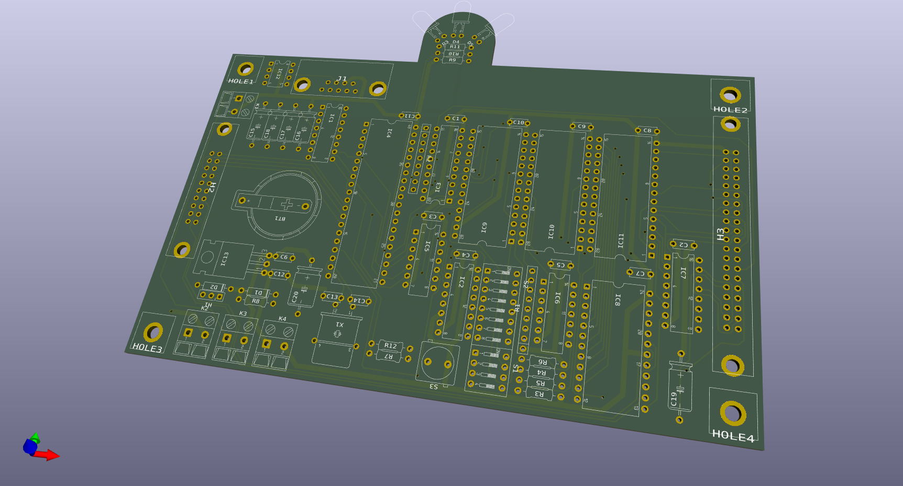
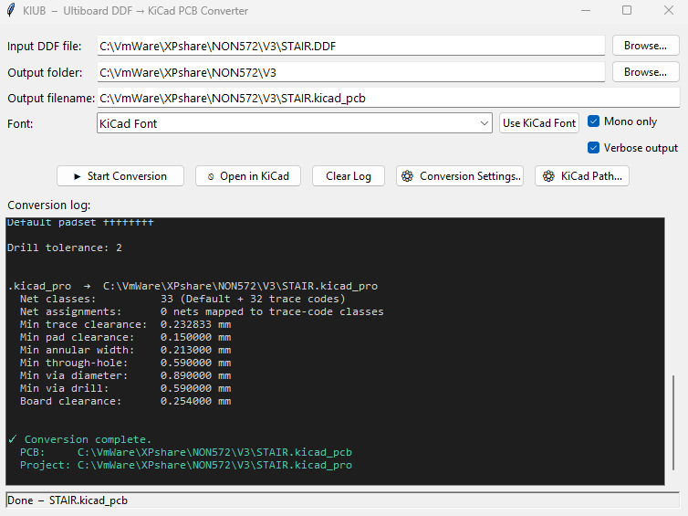
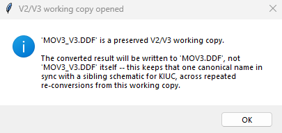
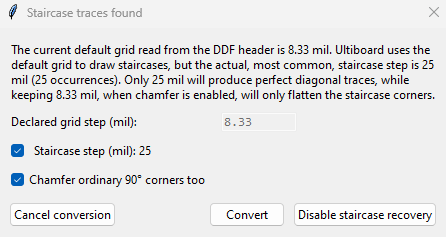
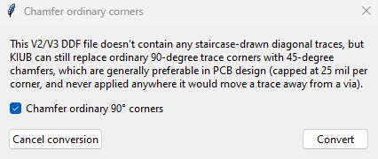
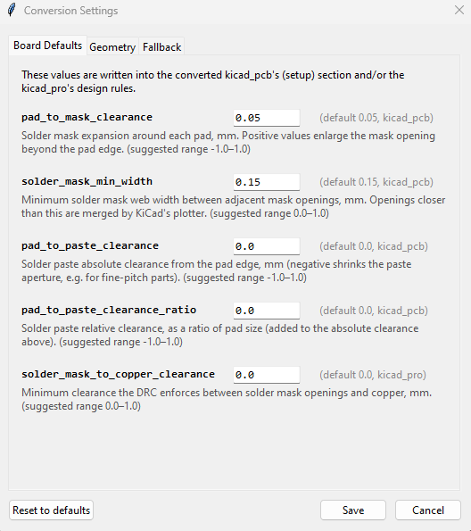
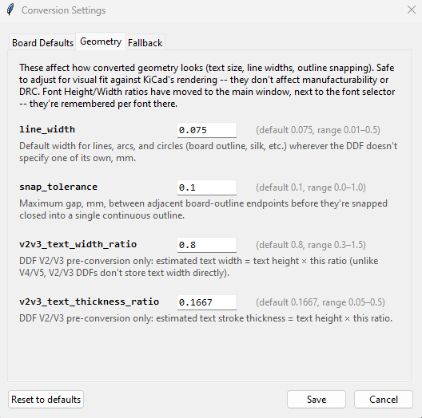
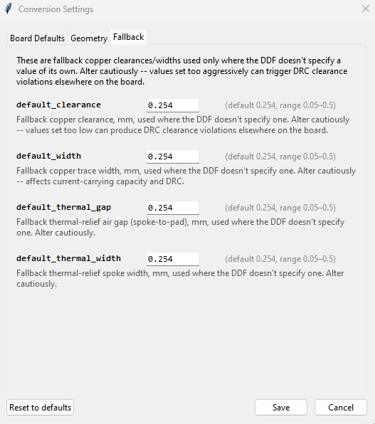

# Ultiboard DDF to KiCad Converter (KIUB)
**Python:** 3.13+ | **License:** GPLv3 | **Target:** KiCad v9+

><ins>**Legal Notice**</ins>\
[KIUB](https://github.com/Snieffy/ultiboard-ddf-to-kicad-converter) is a functional acronym for <ins>**Ki**</ins>Cad <ins>**U**</ins>lti<ins>**B**</ins>oard Converter.\
This is an independent, open-source project and is not affiliated with, sponsored by, or endorsed by any companies sharing a similar name.\
[Ultiboard](https://www.ni.com/nl-be/shop/product/ultiboard.html) is a registered trademark of National Instruments (formerly Ultimate Technology / Electronics Workbench).\
[KiCad](https://www.kicad.org/) is a free software suite for electronic design automation.\
This tool is provided "as-is" for file migration purposes only.

KIUB converts Ultiboard ASCII layout files (`.DDF`) to KiCad 9 PCB format (`.kicad_pcb`).\
It is the PCB counterpart to [KIUC](https://github.com/Snieffy/ulticap-sch-to-kicad-converter),
which converts Ulticap schematic files to KiCad schematic format.

---

## License & Originality

This project is licensed under the **GNU General Public License v3.0 (GPLv3)**.

This software is an original work. No Ultiboard source code, proprietary algorithms, or confidential
materials were used or referenced in its development. The implementation is based entirely on
independent analysis of publicly observable file format behaviour and the 1997 Ultiboard reference manual.

### Development History

KIUB represents a fundamental evolution and complete refactoring of earlier community-driven conversion
concepts. While the electronics industry has moved forward, many valuable legacy designs remain locked
in Ultiboard's proprietary formats. KIUB provides a bridge, allowing engineers to revive and maintain
these designs within the powerful, open-source KiCad ecosystem.

- **Primary Research:**\
  The core parsing logic and technical specifications are derived from the\
  **Ultiboard 32-bit DOS and Windows 95 — Reference Manual — Appendix A — File Formats (1997-08-15)**,\
  supplemented by extensive empirical testing against real Ultiboard DDF files spanning V2.x through V5.x.\
  A full reverse-engineered description of the ASCII DDF file format is provided in [FILEFORMAT-DDF.md](FILEFORMAT-DDF.md).
- **Modern Implementation:**\
  KIUB is a **clean-room-inspired rewrite** in Python 3.13. It abandons procedural limitations in
  favor of a modern, object-oriented architecture.
- **Independent Logic:**\
  Mathematical errors found in abandoned legacy scripts (e.g., arc midpoint calculations and layer
  mapping) have been corrected to ensure compatibility with **KiCad v9+**.

---

## Key Features

- Converts Ultiboard ASCII `.DDF` files to KiCad 9 `.kicad_pcb`, with a matching `.kicad_pro`
  populated from the DDF's own technology data (netclasses, DRC rules, net-to-tracecode assignments)
- Supports the full range of tested versions: V2.x, V3.x, V4.x, and V5.x
  - V2.x/V3.x data is translated by a separate pre-processor (`kiub_v2v3.py`) before reaching the main converter
  - Diagonal traces drawn as V2.x/V3.x "staircases" (the format has no native 45° trace record) are
    recovered as true diagonal traces, and ordinary 90° trace corners can optionally be chamfered to
    45° as well
- Precision handling of tracks, vias, pads (SMD & THT), and complex copper zones
- Accurately converts Ultiboard's internal font encoding to KiCad-compatible text. Best results come
  from KiCad's default font, DejaVu Sans Mono, or the purpose-built **Ultiboard Stroke** font created
  to visually match Ultiboard's own native PCB font — see "Font and Ratio" below for how to install it
- Automatic mapping of Ultiboard layer stackups to KiCad's signal and technical layers
- Board outline reconstruction: separates the true board edge from internal partition/divider lines
  sharing the same outline data stream
- GUI front-end with per-font settings memory, a tabbed Conversion Settings dialog, and interactive
  pop-ups for V2/V3-specific choices (see "GUI" below)
- Zero external dependencies beyond the Python standard library (tkinter for the GUI only)



---

## Requirements

- Python 3.13 or later
- tkinter (required for the GUI only)
- KiCad v9+

The command-line converter (`kiub.py`) has no GUI dependencies at all.

tkinter ships with the standard Python installer on Windows and macOS. On Linux it is usually a
separate package:

```
sudo apt install python3-tk
```

No further installation step is required beyond the above. Download or clone the repository and run
directly from the source folder, keeping `kiub.py`, `kiub_v2v3.py`, and `kiub_gui.py` together in the
same directory.

---

## Usage

### GUI

Launch the converter GUI:

```
python kiub_gui.py
```

**Input DDF file**\
Select the Ultiboard `.DDF` file to convert, either by typing/pasting the path or via **Browse…**.
When no file extension is given, `.DDF` is added automatically.

**Output**\
Set the **Output folder** for the converted files; it follows the input file's own folder
automatically until a folder is explicitly chosen, and reverts to following it again if cleared.
The **Output filename** field controls the stem of the generated `.kicad_pcb` (and matching
`.kicad_pro`); when left empty it is derived from the input DDF filename.

**Font and Ratio**\
Choose the font used for converted text in the **Font** combobox (optionally filtered to
monospaced fonts only via **Mono only**), or click **Use KiCad Font** to reset to the KiCad
default. The **Ratio** fields (**Height**/**Width**) next to it control `font_height_ratio`/
`font_width_ratio` — the empirically-tuned multipliers that make converted text visually match
Ultiboard's own rendering for the selected font. These are remembered **per font**: selecting a
previously-used font auto-fills its last-saved ratio, entering a value outside the suggested
1.0–1.5 range highlights the field, and the current font + ratio pair is saved only when
**Start Conversion** is clicked. Fresh installs are pre-filled with known-good values for KiCad Font, DejaVu Sans Mono, and
Ultiboard Stroke.

> [!NOTE]
> Ultiboard Stroke is not a system font by default — it won't appear in the Font dropdown until
> it's installed like any other font on your OS. The file is included in this repository as
> `fonts/UltiboardStroke-Regular.ttf`.
> - **Windows:** right-click the file → **Install** (or **Install for all users**).
> - **macOS:** double-click the file → **Install Font** in Font Book.
> - **Linux:** copy it to `~/.local/share/fonts/` (or `/usr/share/fonts/` system-wide), then run `fc-cache -f`.
>
> Restart KIUB's GUI afterwards so it picks up the newly installed font.

**Actions**

| Button⠀⠀⠀⠀⠀⠀⠀⠀⠀⠀⠀⠀⠀⠀⠀⠀⠀⠀⠀| Description |
| --- | --- |
| **▶ Start Conversion** | Run the conversion and write the `.kicad_pcb`/`.kicad_pro` files to the selected folder. Triggers the automatic pre-conversion checks below first. |
| **⎋ Open in KiCad** | Open the converted project directly in KiCad. Enabled only after a successful conversion. Set the path using **KiCad Path…**. |
| **Clear Log** | Clear the on-screen conversion log. |
| **⚙ Conversion Settings…** | Opens the Conversion Settings dialog (see below). |
| **⚙ KiCad Path…** | Set and save the path to the KiCad executable used by Open in KiCad. |

The conversion log (verbose or brief, depending on **Verbose output**) is shown on-screen and also
written to a `_log.txt` file in the output directory.



**Automatic pre-conversion checks**\
Before Start Conversion actually runs, KIUB checks the input file in order: V2/V3 rename notice
(first run only), reference designators, then staircase/chamfer detection for V2/V3 files. Each
can stop the conversion if declined.

**V2/V3 rename notice**\
Converting a V2/V3 DDF file also rewrites it on disk, not just the `.kicad_pcb` output: the
original V2/V3 file is preserved alongside it as `<name>_V3.DDF`, and the converted V4-format
result is written back to `<name>.DDF` itself — so the canonical filename always ends up holding
the current, converted result. This matters for anything that locates "the DDF file for this
project" by that exact name, such as [KIUC](https://github.com/Snieffy/ulticap-sch-to-kicad-converter)
finding a sibling DDF during schematic reference-designator reannotation. A pre-existing
`<name>_V3.DDF` from an earlier run is silently overwritten. If you keep editing the design
afterwards in a version of Ultiboard that still requires the V2/V3 format, do that editing in the
preserved `<name>_V3.DDF` copy and re-run KIUB on *that* file each time — KIUB recognizes a
`_V3`-suffixed input as an already-preserved working copy and leaves it untouched, writing each new
result to `<name>.DDF` instead of nesting another `_V3` suffix onto it. Every DDF file KIUB writes
or rewrites ends in a genuine blank line, which Ultiboard requires to open a DDF correctly. This
notice is shown once; afterwards the rename still happens, just without the pop-up.



**Reference designators**\
When the DDF contains reference designators that don't end in a digit (e.g. `TP`, `FID`), KiCad
will treat these as unannotated. KIUB shows the offending list and, if a sibling schematic
(`.SCH`/`.kicad_sch`) is found next to the DDF, recommends running
[KIUC](https://github.com/Snieffy/ulticap-sch-to-kicad-converter)'s Refdes Reannotate tool first,
since renaming these independently of the schematic breaks their sync. You can still continue the
conversion as-is; KiCad's PCB editor accepts non-digit-ending references without issue if no
schematic exists for the board.

**Staircase-to-diagonal recovery and chamfering**\
When a V2/V3 file contains diagonal traces drawn as staircases, a pop-up shows the file's declared
routing grid (editable) and lets you disable staircase recovery and/or chamfering for that
conversion. If no staircases are found, a smaller pop-up still offers the chamfering option, since
it applies independently of staircase recovery.




**Conversion Settings**\
A single tabbed dialog covering board-default values and fine-tuning constants. Alter these
cautiously — wrong values can result in DRC errors. Changes take effect on the next conversion and
are saved to `kiub_gui.ini`.

*Board Defaults* — written into the converted `.kicad_pcb`'s `(setup)` section and/or the
`.kicad_pro`'s design rules:

| Parameter⠀⠀⠀⠀⠀⠀⠀⠀⠀⠀⠀⠀⠀⠀⠀⠀⠀⠀⠀⠀⠀⠀⠀⠀⠀⠀⠀⠀⠀⠀⠀| Default | Description |
| --- | :---: | --- |
| **pad_to_mask_clearance** | 0.05 | Solder mask expansion around each pad, mm. Positive values enlarge the mask opening beyond the pad edge. |
| **solder_mask_min_width** | 0.15 | Minimum solder mask web width between adjacent mask openings, mm. Openings closer than this are merged by KiCad's plotter. |
| **pad_to_paste_clearance** | 0.0 | Solder paste absolute clearance from the pad edge, mm (negative shrinks the paste aperture, e.g. for fine-pitch parts). |
| **pad_to_paste_clearance_ratio** | 0.0 | Solder paste relative clearance, as a ratio of pad size (added to the absolute clearance above). |
| **solder_mask_to_copper_clearance** | 0.0 | Minimum clearance the DRC enforces between solder mask openings and copper, mm. |



*Geometry* — affect how converted geometry looks (text size, line widths, outline snapping). Safe
to adjust for visual fit against KiCad's rendering; they don't affect manufacturability or DRC.
Font Height/Width ratios have moved to the main window, next to the font selector — see "Font and
Ratio" above.

| Parameter⠀⠀⠀⠀⠀⠀⠀⠀⠀⠀⠀⠀⠀⠀⠀⠀⠀⠀⠀| Default | Description |
| --- | :---: | --- |
| **line_width** | 0.075 | Default width for lines, arcs, and circles (board outline, silk, etc.) wherever the DDF doesn't specify one of its own, mm. |
| **snap_tolerance** | 0.1 | Maximum gap, mm, between adjacent board-outline endpoints before they're snapped closed into a single continuous outline. |
| **v2v3_text_width_ratio** | 0.8 | DDF V2/V3 pre-conversion only: estimated text width = text height × this ratio (unlike V4/V5, V2/V3 DDFs don't store text width directly). |
| **v2v3_text_thickness_ratio** | 0.1667 | DDF V2/V3 pre-conversion only: estimated text stroke thickness = text height × this ratio. |



*Fallback* — copper clearances/widths used only where the DDF doesn't specify a value of its own.
Alter cautiously — values set too aggressively can trigger DRC clearance violations elsewhere on
the board.

| Parameter⠀⠀⠀⠀⠀⠀⠀⠀⠀⠀⠀⠀⠀⠀⠀⠀⠀⠀⠀⠀⠀⠀⠀| Default | Description |
| --- | :---: | --- |
| **default_clearance** | 0.254 | Fallback copper clearance, mm, used where the DDF doesn't specify one. |
| **default_width** | 0.254 | Fallback copper trace width, mm, used where the DDF doesn't specify one. Affects current-carrying capacity and DRC. |
| **default_thermal_gap** | 0.254 | Fallback thermal-relief air gap (spoke-to-pad), mm, used where the DDF doesn't specify one. |
| **default_thermal_width** | 0.254 | Fallback thermal-relief spoke width, mm, used where the DDF doesn't specify one. |



**Settings file**\
The GUI persists its own settings to `kiub_gui.ini`, created next to `kiub_gui.py` — but not until
something actually needs saving; opening the GUI by itself creates nothing. Each section is added
independently, the first time its own setting is actually used: `[kicad]` (KiCad executable path),
`[notices]` (one-time pop-up flags), `[board_defaults]`/`[fine_tuning]` (Conversion Settings dialog
values), and `[font_ratios]`/`[last_used]` (per-font Height/Width ratio memory — see "Font and
Ratio" above). In practice, `[font_ratios]`/`[last_used]` are usually the first to appear, written
together the first time **Start Conversion** is clicked — at that point all three known fonts are
saved at once, not just whichever one was in use. This file holds local machine state (it can end
up recording a local KiCad install path), so it isn't part of this repository — if you keep this
folder under version control yourself, add `kiub_gui.ini` to your own `.gitignore`.

---

### Command Line

```
python kiub.py test.ddf
```

```
python kiub.py "C:\source_folder\test" -o "D:\destination_folder\test_result" -f "DejaVu Sans Mono"
```

When no file extension is specified, `.DDF` is added to the input file and/or `.kicad_pcb` to the
output file. When `-o`/`--outfile` is omitted, the output file takes the same name as the input DDF.

| Option⠀⠀⠀⠀⠀⠀⠀⠀⠀⠀⠀⠀⠀⠀⠀⠀⠀⠀⠀⠀⠀⠀⠀⠀⠀⠀⠀⠀⠀⠀⠀⠀⠀⠀⠀⠀⠀⠀⠀⠀⠀⠀⠀⠀⠀⠀⠀⠀| Description |
|---|---|
| `infile` | Path/name of the Ultiboard DDF file. |
| `-o` / `--outfile` | Path/name of the KiCad file. When omitted, takes the same name as the input DDF. |
| `-f` / `--font` | Replace the default KiCad font with a user-specified font during conversion. Optimal results are obtained using Ultiboard Stroke or DejaVu Sans Mono — see the font ratio flags below. Default: `KiCad Font`. |
| `-v` / `--verbose` | Print progress information during conversion. |
| `--yes` | Do not prompt when non-digit-ending reference designators are found; continue automatically. Needed for non-interactive/scripted use, since this is otherwise the CLI's one interactive prompt. |

**Board defaults** — written into the converted `.kicad_pcb`'s `(setup)` section and/or the
`.kicad_pro`'s design rules; mirrors the GUI's Board Defaults tab:

| Option | Description |
|---|---|
| `--pad-to-mask-clearance` | Solder mask expansion around each pad, mm. Positive values enlarge the mask opening beyond the pad edge. Default: `0.05`, suggested range `-1.0`–`1.0`. |
| `--solder-mask-min-width` | Minimum solder mask web width between adjacent mask openings, mm. Default: `0.15`, suggested range `0.0`–`1.0`. |
| `--pad-to-paste-clearance` | Solder paste absolute clearance from the pad edge, mm. Default: `0.0`, suggested range `-1.0`–`1.0`. |
| `--pad-to-paste-clearance-ratio` | Solder paste relative clearance, as a ratio of pad size. Default: `0.0`, suggested range `-1.0`–`1.0`. |
| `--solder-mask-to-copper-clearance` | Minimum clearance the DRC enforces between solder mask openings and copper, mm. Default: `0.0`, suggested range `0.0`–`1.0`. |

**Fine-tuning (geometry)** — visual fit against KiCad's rendering; doesn't affect manufacturability
or DRC; mirrors the GUI's Geometry tab and the main window's Font/Ratio fields:

| Option | Description |
|---|---|
| `--font-height-ratio` | KiCad text height = Ultiboard text height ÷ this ratio. Default: `1.208`, suggested range `1.0`–`1.5`. |
| `--font-width-ratio` | KiCad text width = Ultiboard text width × this ratio. Default: `1.186`, suggested range `1.0`–`1.5`. |
| `--line-width` | Default width for lines, arcs, and circles wherever the DDF doesn't specify one, mm. Default: `0.075`, suggested range `0.01`–`0.5`. |
| `--snap-tolerance` | Maximum gap, mm, between adjacent board-outline endpoints before they're snapped closed. Default: `0.1`, suggested range `0.0`–`1.0`. |

**Fine-tuning (fallback clearance)** — alter cautiously; mirrors the GUI's Fallback tab:

| Option | Description |
|---|---|
| `--default-clearance` | Fallback copper clearance, mm, used where the DDF doesn't specify one. Default: `0.254`, suggested range `0.05`–`0.5`. |
| `--default-width` | Fallback copper trace width, mm, used where the DDF doesn't specify one. Default: `0.254`, suggested range `0.05`–`0.5`. |
| `--default-thermal-gap` | Fallback thermal-relief air gap (spoke-to-pad), mm, used where the DDF doesn't specify one. Default: `0.254`, suggested range `0.05`–`0.5`. |
| `--default-thermal-width` | Fallback thermal-relief spoke width, mm, used where the DDF doesn't specify one. Default: `0.254`, suggested range `0.05`–`0.5`. |

**V2/V3 pre-conversion options** — only apply when converting a V2.x/V3.x DDF file; no effect on
native V4.x/V5.x files:

| Option | Description |
|---|---|
| `--v2v3-text-width-ratio` | Estimated text width = text height × this ratio (V2/V3 DDFs don't store text width directly). Default: `0.8`, suggested range `0.3`–`1.5`. |
| `--v2v3-text-thickness-ratio` | Estimated text stroke thickness = text height × this ratio. Default: `0.1667`, suggested range `0.05`–`0.5`. |
| `--v2v3-staircase-limit-mil MIL` | Maximum length (mil) for a single staircase grid step recovered as a diagonal trace. Default: the file's own declared default grid step, always capped at a fixed 25 mil ceiling regardless of this override or the file's declared grid. |
| `--v2v3-no-staircase-merge` | Disable staircase-to-diagonal recovery entirely (default: enabled). |
| `--v2v3-corner-slant-limit-mil MIL` | Maximum length (mil) to trim off each leg of an ordinary 90° trace corner when chamfering it. Default: tracks `--v2v3-staircase-limit-mil` (or its own auto default, if that isn't set either). |
| `--v2v3-no-chamfer` | Disable corner-slanting (chamfering ordinary 90° trace corners) entirely (default: enabled). |

A few things run automatically on the CLI with no flag needed: the V2/V3 rename-and-write-back
(see "V2/V3 rename notice" above — happens silently, without the GUI's one-time pop-up), and
staircase/chamfer recovery itself (use the flags above only to change its limits or disable it).
The one exception is non-digit-ending reference designators, which print a warning and continue
unless `--yes` is given to suppress the warning.

> [!NOTE]
> The `DDF` folder contains sample DDF files to demonstrate the conversion capabilities.
>
> Polygons need to be reconstructed once the file is opened in KiCad, as only the outline and hatch
> settings are copied. Either open the 'Edit' menu and select 'Fill all zones', or press the 'B'
> key. Don't forget to save the updated design.

---

## Conversion Notes

The software has been thoroughly tested against many different PCB designs. Even though great care
has been taken to accurately mimic the DDF design in KiCad, small differences are still possible.

> [!NOTE]
> KIUB creates PCB files readable by KiCad v9. While the design data itself is accurate, KiCad
> performs a one-time update of the S-expression notation the first time the converted file is
> opened.

Implementation and behaviour notes below cover how KIUB's own choices show up in the converted
`.kicad_pcb`/`.kicad_pro`, and how to work with that output in KiCad. For the DDF file format
itself — record layouts, rotation/layer encoding, font handling, board-outline reconstruction, and
known errata in the original Ultiboard reference manual — see [FILEFORMAT-DDF.md](FILEFORMAT-DDF.md).

**Board setup**\
Paper size is derived from the DDF's own board extents and set automatically, A5 up to A0. Solder
mask minimum width defaults to `0.15` mm in the generated `.kicad_pcb` header, tunable in the GUI's
Conversion Settings dialog (Board Defaults tab) or via `--solder-mask-min-width`.

**Pads**\
Through-hole pads become an SMD pad plus a separate through-hole pad, both sharing the same
pin/net number. Since the real pad geometry already lives on the SMD pad, the through-hole pad's
own size no longer needs to match it — only the drill diameter matters for connectivity — but
KiCad still requires a through-hole pad's size to exceed its drill size, so KIUB sets it to drill
diameter + 0.01 mm. This construction causes KiCad's DRC to report a "Padstack is questionable (SMD
pad has no outer layer)" warning; KIUB disables that specific warning in the generated
`.kicad_pro`. Separately, KiCad's PCB view will not display an Inner-layer pad if that layer is
otherwise padless on that pad stack (an apparent KiCad bug) — the 3D viewer shows it correctly
regardless. Zero-diameter drill codes (the SMD-trick sentinel) and NPTH handling for drill-only
codes are DDF-format-level behaviour — see FILEFORMAT-DDF.md
[§10.4](FILEFORMAT-DDF.md#104-drill-codes-and-the-smd-trick) and
[§2](FILEFORMAT-DDF.md#2-technology-data--t-records).

**Pad clearance and the mass pad-clearance reset**\
Each pad's clearance, as read from the DDF, is written directly into that pad's own definition in
the KiCad file. In KiCad, a pad's local clearance override always takes priority over both the
board-wide default clearance and any zone/polygon clearance — so a copper pour using a different
clearance than a pad's local value will still back off to that pad's local value, not the pour's
own. If you want a polygon's own clearance to govern pad clearances as well, all pad clearances
need to be forced back to `0` (KiCad's "fall back to default/polygon clearance" sentinel) after
conversion:

1. **Configure the Selection Filter** — bottom-right corner of the PCB Editor — and uncheck
   everything except *Pads*.
2. **Select all pads** — click inside the layout area, then `Ctrl+A`.
3. **Open the Properties panel**, if not already open: *View → Panels → Properties*.
4. **Set clearances to 0** — in the Properties panel's *Overrides* section, set *Clearance
   Override* to `0`.
5. **Re-pour zones** — press `B` to update all copper zones with the new clearances.

**Vias**\
Ultiboard allows non-round via shapes; KiCad's standard vias support round shapes only, so every
via is converted to round using the DDF's own annular-ring and pad-size data per layer (F.Cu, B.Cu,
In*.Cu) — see FILEFORMAT-DDF.md
[§10.7](FILEFORMAT-DDF.md#107-known-errata-in-the-1997-reference-manual) for the non-round-via
erratum this addresses.

---

## Contributing

Contributions are welcome! If you find edge cases in specific DDF versions, please open an issue or submit a pull request.\
As this project is GPLv3, all derivatives must remain open and free.
